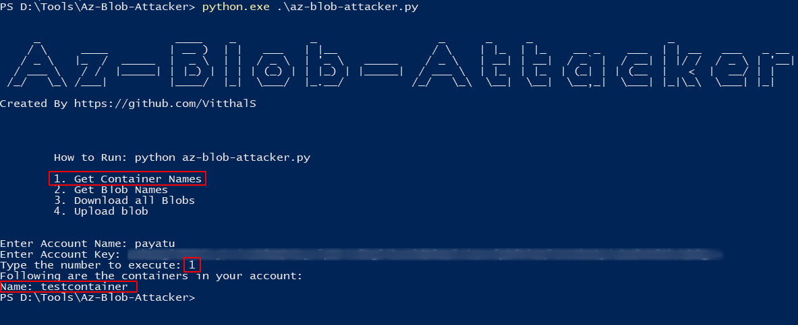
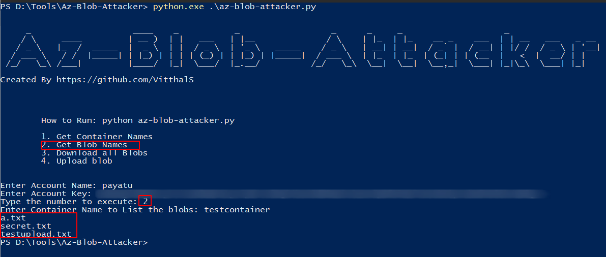
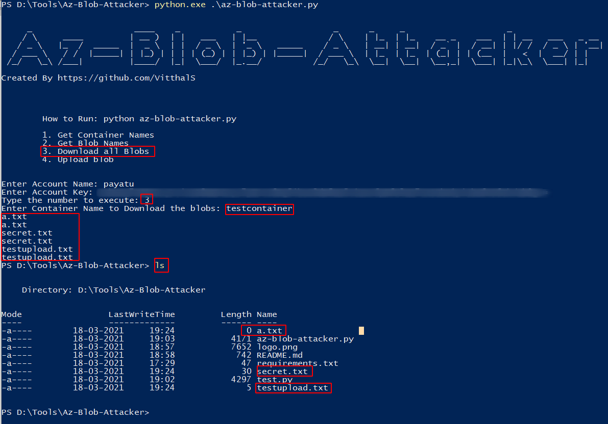
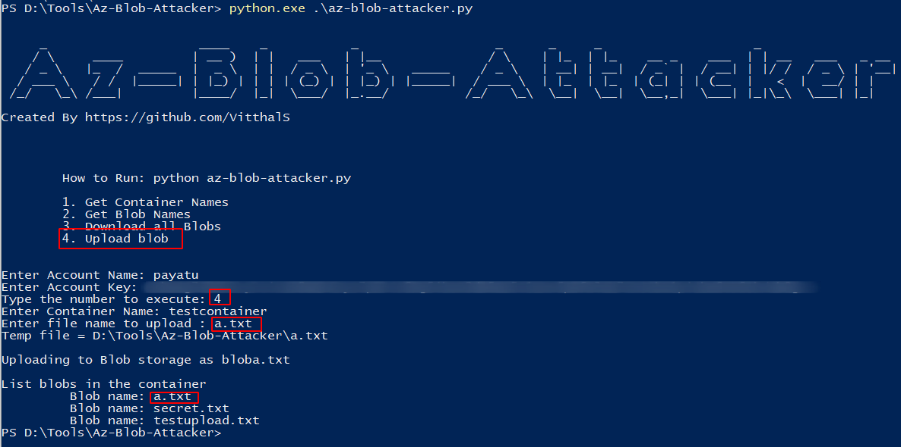
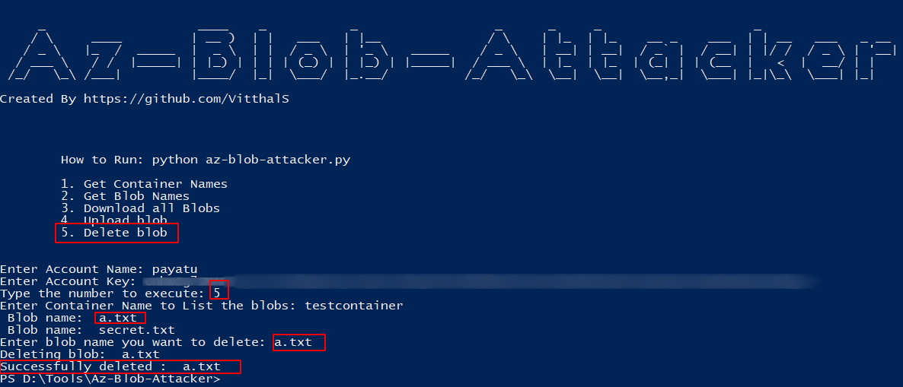

# Az-Blob-Attacker

Azure storage attacker

This tool will help you to perform following operations if you have storage account name and key.

- Get Container Names
- Get Blob names
- Download all Blobs
- Upload a Blob
- Delete a Blob

## Install

    git clone https://github.com/VitthalS/Az-Blob-Attacker.git
    cd Az-Blob-Attacker
    pip install -r requirements.txt
    python Az-Blob-Attacker.py

## Usage

1. Run the tool by executing below command in the console.

    `python az-blob-attacker.py`

2. To get the container names associated to storage account enter number 1.

    

3. To get the blob names associated to storage account & container enter number 2.

    

4. To Download all the blobs associated to storage account & container enter number 3.

    

5. To upload a blob to container enter number 4 and specify the path to file.

    

6. To delete a blob from specified container enter number 5

    

## Contributing

1. Fork it, baby!
2. Create your feature branch: `git checkout -b my-new-feature`
3. Commit your changes: `git commit -am 'Add some feature'`
4. Push to the branch: `git push origin my-new-feature`
5. Submit a pull request.